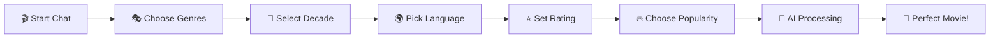

# 🎬 CineAI Recommender ✨
### *Your AI-Powered Movie Discovery Companion*

<div align="center">


### 🚀 **[LIVE DEMO](https://cineai-ali.vercel.app/)** 🚀

*A sophisticated AI-powered movie recommendation chatbot with a dark‑gold UI, smooth animations, and rich actions like Download Poster, Watch Trailer, and one‑click Rivestream search.*

---

</div>

## 🌟 **What Makes CineAI Special?**

<table>
<tr>
<td width="50%">

### 🤖 **Smart AI Recommendations**
- **Hugging Face AI** analyzes your preferences
- **Personalized suggestions** based on your mood
- **Intelligent conversation flow** for better understanding
- **Multiple fallback systems** ensure you always get recommendations

</td>
<td width="50%">

### 🎬 **Rich Movie Experience**
- **TMDB Integration** for comprehensive movie data
- **Official trailers** with built-in video player
- **High-quality posters** and movie artwork
- **Detailed information** including ratings and release dates

</td>
</tr>
<tr>
<td width="50%">

### 🎨 **Stunning Visual Design**
- **Dark gold theme** with premium aesthetics
- **Glassmorphism effects** for modern UI
- **Framer Motion animations** for smooth interactions
- **Fully responsive** design for all devices

</td>
<td width="50%">

### ⚡ **Modern Tech Stack**
- **Next.js 15** with App Router
- **TypeScript** for type safety
- **Tailwind CSS** for rapid styling
- **100% Free APIs** - no costs involved!

</td>
</tr>
</table>

## 🎯 **How It Works**



<div align="center">

### 💫 **Experience the Magic** 💫

**Interactive Chat Interface** → **AI Analysis** → **Perfect Movie Match** → **Actions: Download Poster / Watch Trailer / Rivestream**

</div>

## 🛠️ **Tech Stack & Architecture**

<div align="center">

| Frontend | Backend | APIs | Deployment |
|----------|---------|------|------------|
|  |  |  |  |
|  |  |  |  |
|  |  | | |

</div>

### 🎨 **Design Philosophy**
- **Dark Gold Aesthetic**: Premium color palette with `#FFD700` accents
- **Glassmorphism**: Modern frosted glass effects
- **Micro-interactions**: Smooth hover effects and transitions
- **Mobile-first**: Responsive design that works everywhere

## ⚡ **Quick Start Guide**

### 🚀 **Option 1: Try it Live** (Recommended)
```bash
🌐 Visit: https://cineai-2futhd8bq-ali-mahdis-projects.vercel.app
✨ Start chatting with the AI immediately!
```

### 💻 **Option 2: Run Locally**

```bash
# 📥 Clone the repository
git clone https://github.com/Alilo2005/CineAi.git
cd CineAi

# 📦 Install dependencies
npm install

# 🔑 Set up your free API keys
cp .env.example .env.local
# Edit .env.local with your API keys (see setup guide below)

# 🚀 Start the development server
npm run dev

# 🌐 Open your browser
open http://localhost:3000
```

### 🔑 **Free API Setup** (2 minutes!)

<details>
<summary><b>📋 Click to expand API setup instructions</b></summary>

Create a `.env.local` file:

```bash
# 🎬 TMDB API (100% FREE!)
NEXT_PUBLIC_TMDB_API_KEY=your_tmdb_key_here
NEXT_PUBLIC_TMDB_BASE_URL=https://api.themoviedb.org/3

# 🤖 Hugging Face API (100% FREE!)
NEXT_PUBLIC_HUGGINGFACE_API_KEY=your_huggingface_key_here
```

**Get your free API keys:**
1. **TMDB**: [Register here](https://www.themoviedb.org/settings/api) - Instant approval!
2. **Hugging Face**: [Sign up here](https://huggingface.co/settings/tokens) - No verification needed!

</details>

## 🎮 **Features Showcase**

<div align="center">

| 🎬 **Movie Discovery** | ⚙️ **Handy Actions** | 🎨 **Beautiful UI** |
|:---:|:---:|:---:|
| Smart AI recommendations | Download Poster as JPG | Dark gold theme with glassmorphism |
| TMDB database integration | Watch Trailer in a new tab | Framer Motion animations |
| Genre-based filtering | Rivestream: copies title to clipboard + opens search | Responsive design |

</div>

### 🧭 **User Experience Flow**

1. **🎭 Chat Interface**: Engaging conversation with the AI
2. **🎨 Preference Collection**: Genre, decade, language, rating preferences
3. **🤖 AI Processing**: Smart analysis using Hugging Face models
4. **🎬 Movie Presentation**: Beautiful movie cards with all details
5. **⚙️ Quick Actions**:
    - **Download Poster**: Saves the poster locally (with CORS‑safe fallback)
    - **Watch Trailer**: Opens the official trailer in a new tab (prefetched)
    - **Find on Rivestream**: Copies the movie title to your clipboard and opens Rivestream search

### 💫 **Interactive Elements**

- **Smooth Animations**: Every interaction feels fluid and responsive
- **Hover Effects**: Subtle micro-interactions enhance user engagement
- **Loading States**: Beautiful loading spinners keep users engaged
- **Error Handling**: Graceful fallbacks ensure the app always works

## � **Roadmap & Future Features**

<div align="center">

### 🎯 **Coming Soon**

</div>

| Status | Feature | Description |
|:---:|:---|:---|
| 🔄 | **User Accounts** | Save preferences and movie history |
| 🔄 | **Watchlists** | Create and manage personal movie lists |
| 🔄 | **Social Sharing** | Share recommendations with friends |
| 🔄 | **Streaming Integration** | Direct links to Netflix, Prime, etc. |
| 🔄 | **Advanced Filters** | More granular movie filtering options |
| 🔄 | **Movie Reviews** | Read and write movie reviews |
| 🔄 | **Dark/Light Mode** | Theme switching capability |
| 🔄 | **PWA Support** | Install as a mobile app |

## 🤝 **Contributing**

<div align="center">

**We love contributions!** 🎉

[](https://github.com/Alilo2005/CineAi/issues)
[](https://github.com/Alilo2005/CineAi/stargazers)
[](https://github.com/Alilo2005/CineAi/network)

</div>

### 🛠️ **How to Contribute**

1. **🍴 Fork** the repository
2. **🌟 Create** a feature branch: `git checkout -b amazing-feature`
3. **💫 Commit** your changes: `git commit -m 'Add amazing feature'`
4. **🚀 Push** to the branch: `git push origin amazing-feature`
5. **🎉 Open** a Pull Request

## 📄 **License**

<div align="center">

This project is licensed under the **MIT License** - see the [LICENSE](LICENSE) file for details.

**Free to use, modify, and distribute!** 🎉

</div>

## 🙏 **Acknowledgments & Credits**

<div align="center">

### 💝 **Special Thanks To**

</div>

<table align="center">
<tr>
<td align="center" width="25%">
<br/>
<b>Hugging Face</b><br/>
<sub>Free AI Models</sub>
</td>
<td align="center" width="25%">
<br/>
<b>TMDB</b><br/>
<sub>Movie Database</sub>
</td>
<td align="center" width="25%">
<br/>
<b>Framer Motion</b><br/>
<sub>Smooth Animations</sub>
</td>
<td align="center" width="25%">
<br/>
<b>Tailwind CSS</b><br/>
<sub>Beautiful Styling</sub>
</td>
</tr>
</table>

---

<div align="center">

### 🌟 **Show Some Love** 🌟

**If you found this project helpful, please consider:**

[](https://github.com/Alilo2005/CineAi)
[](https://github.com/Alilo2005/CineAi/issues)
[](https://github.com/Alilo2005/CineAi/issues)

---

### 🎬 **Built with ❤️, AI, and lots of ☕** 

**Ready to discover your next favorite movie?** [**Try CineAI Now!**](https://cineai-2futhd8bq-ali-mahdis-projects.vercel.app) 🚀

## 🔄 Recent Changes

- Removed the in-chat trailer embed and the “show trailer?” question for a cleaner flow
- Added a Watch Trailer button on the movie card (opens in new tab; URL is prefetched for speed)
- Rivestream button now copies the movie title to your clipboard before opening the search
- Added a small in-card toast confirming clipboard copy
- Download Poster action now fetches the high‑res image and falls back to opening in a new tab if needed

</div>
